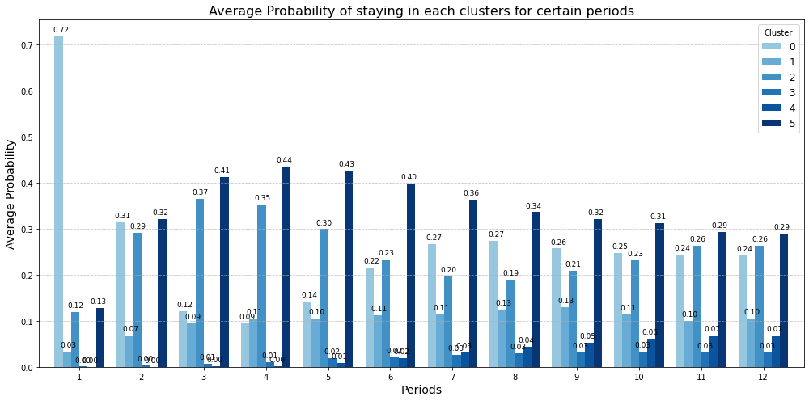

# Forecast Economic conditions using Marcov Chain and Monte Carlo Simulation.
Here, I developed a Monte Carlo simulation model with a Markov Chain transition matrix to analyze the probabilistic dynamics of future scenario transitions and the duration a newly entered state is expected to persist. This project presents a quantitative modeling framework designed to forecast economic conditions over a one-year horizon, assuming the absence of external shocks.

## Data

* MSCI ACWI Index
* The baseline period covers weekly observations from December 29, 1995, through January 3, 2025.

## Model Description

* GARCH Model for volatility

A GARCH(1,1) model is applied to MSCI ACWI returns to estimate time-varying volatility. The resulting volatility estimates, together with returns, serve as key features for clustering and regime identification.
(See details in [MSCI Analysis](MSCI_Analysis_0905.ipynb))

* Gaussian Mixture Model(GMM)

Using the estimated volatility, the study constructs clustering features based on standardized returns and log-volatility. Specifically, Gaussian Mixture Models (GMM) are applied to these features to identify distinct economic regimes. The optimal number of regimes is determined using information criteria; however, six clusters are selected to represent different global economic states in order to align with previous research.

## Clusters 

- Neutral Stable:\
Cluster 0: Around zero Return, Low Volatility
- Mild Recession:\
Cluster 1: Negative Return, Moderate Volatility
- Expension:\
Cluster 2: Positive Return, Moderater Volatility
- Crisis:\
Cluster 3: Extreme Negative or Positive Return, High Volatility
- Deflationary Trap / Stagnation:\
Cluster 4: Close to zero or slightly Negative Return, Extremely low Volatility
- Post-Policy Calm / Stabilization Phase:\
Cluster 5: Mild Postive Return, Lowest Volatility

Based on these datasets and models, this project examines regime dynamics over a one-year forward horizon. For instance, at a monthly evaluation frequency, the framework computes the average probability of occupying each regime at each future point in time and presents the results graphically. 

To support this analysis, three variable-generation models are constructed: 
1. Semi-Markov regime-transition matrix
2. Next-regime transition probability
3. Regime staying-duration variable. 

These models are combined and run 1,000 Monte Carlo simulations to generate forward-looking regime dynamics, which are presented below.

## Results

